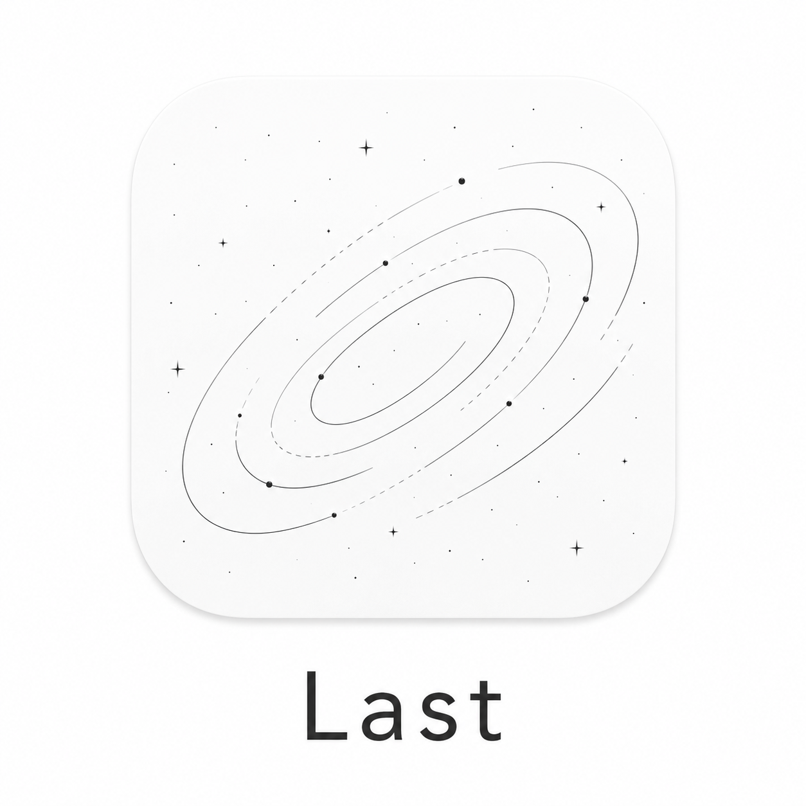
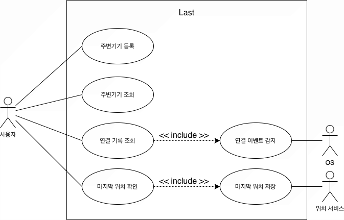
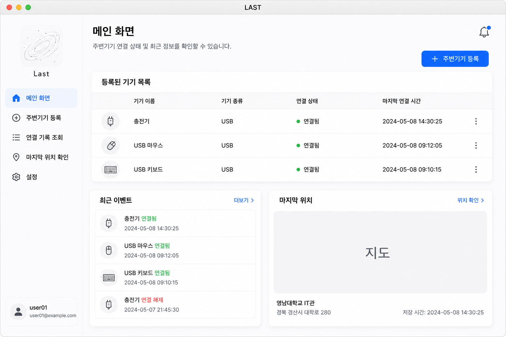
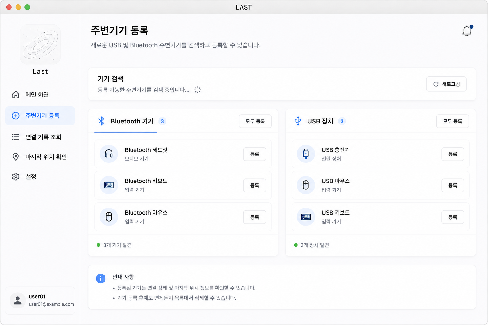
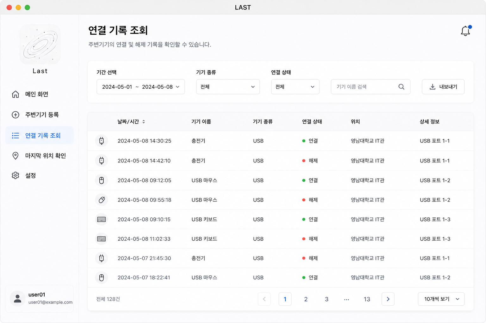
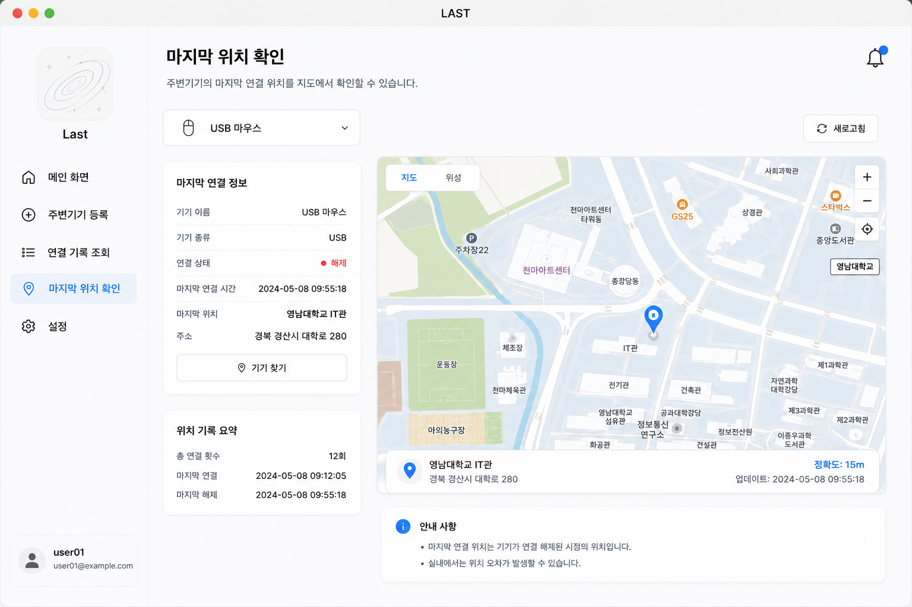
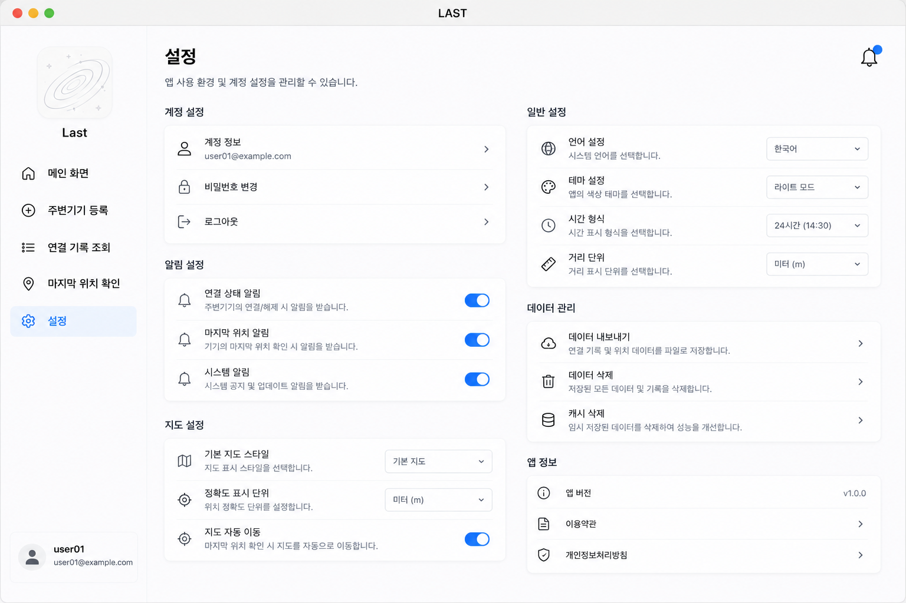

# Analysis

  

| No | 22212058 |
| --- | --- |
| Name | 장민기 |
| E-mail | mingijang@yu.ac.kr |

---

# Revision history

| Revision date | Version # | Description | Anthor |
| --- | --- | --- | --- |
|  |  |  |  |
|  |  |  |  |
|  |  |  |  |
|  |  |  |  |
|  |  |  |  |

---

# Contents

1. Introduction
2. Use case analysis
3. Domain analysis
4. User Interface prototype
5. Glossary
6. References

---

# 1. Introduction

### 개요

 현대의 대학생 및 노트북 사용자는 USB, Bluetooth 기반 주변기기를 일상적으로 사용하고 있다. 하지만 마우스, 키보드, USB 메모리, 충전기 등의 주변기기를 실습실, 카페, 강의실 등에 두고 이동하는 경우가 자주 발생하며, 사용자는 마지막 사용 위치를 기억하지 못해 다시 이동하거나 분실 위험을 겪게 된다.

 실제로 본인 또한 학교 실습실에서 마우스를 두고 이동한 뒤 다시 찾으러 간 경험이 여러 차례 있었으며, 이러한 경험은 특정 사용자만의 문제가 아니라 노트북 기반 작업 환경 전반에서 빈번하게 발생하는 문제이다.

 LAST는 이러한 문제를 해결하기 위해 기획된 macOS 기반 주변기기 추적 시스템이다. 시스템은 USB 및 Bluetooth 장치의 연결 상태를 지속적으로 모니터링하고, 연결 해제 이벤트가 발생하는 순간의 위치 및 시간을 자동 기록하여 사용자가 마지막 사용 위치를 직관적으로 확인할 수 있도록 지원한다.

### 특징

1. 주변기기 연결 이벤트 자동 감지

2. 마지막 연결 위치 저장

3. 이벤트 로그 기반 기록 관리

4. 미니멀 UI 기반 사용자 경험

5. 실시간 백그라운드 모니터링

### 의의

 기존의 위치 추적 시스템은 스마트폰이나 GPS 기반 장치 중심으로 구성되어 있으며, 일반적인 USB 또는 Bluetooth 주변기기의 마지막 사용 위치를 기록하는 기능은 상대적으로 부족한 상황이다.

 LAST는 별도의 고가 추적 장치 없이 운영체제의 연결 이벤트를 활용하여 실질적인 분실 방지 기능을 제공한다는 점에서 차별성을 가진다.

또한 단순한 분실 예방 기능을 넘어 학교 실습실 장비 관리, 연구실 공용 장치 관리, 기업 환경 내 장비 사용 기록 관리와 같은 다양한 활용 가능성을 가진다.

### 확장 가능성

 향후 프로젝트 확장을 통해 다음과 같은 기능 추가가 가능하다. 단순한 개인용 분실 방지 애플리케이션을 넘어 통합 스마트 디바이스 관리 플랫폼으로 발전할 수 있다.

- iPhone 및 Apple Watch 연동
- iCloud 기반 위치 동기화
- AI 기반 분실 위치 예측
- 지도 기반 이동 경로 시각화
- 주변기기 자동 분류 기능
- 다중 사용자 장치 관리 기능

---

### 2. Use case analysis

> LAST 시스템은 사용자가 등록한 USB 및 Bluetooth 주변기기의 연결 상태를 지속적으로 감시하고, 연결 해제 이벤트 발생 시 마지막 위치를 자동 저장하는 구조로 동작한다.
> 

---

1. 주변기기 등록

GENERAL CHARACTERISTICS

| Summary | 사용자가 새로운 주변기기를 LAST 시스템에 등록하기 위해 사용하는 기능 |
| --- | --- |
| Scope | LAST 시스템 |
| Level | User Level |
| Author | 장민기 |
| Last Update | 2026-05-08 |
| Status | Analysis |
| Primary Actor | 사용자 |
| Preconditions | 시스템이 실행 중이어야 한다. |
| Trigger | 사용자가 주변기기 등록 버튼을 선택할 때 |
| Success Post Condition | 선택한 주변기기가 시스템에 정상 등록된다. |
| Failed Post Condition | 주변기기 등록에 실패한다. |

MAIN SUCCESS SCENARIO

| Step | Action |
| --- | --- |
| 1 | 사용자가 시스템에서 주변기기 등록 기능을 실행한다. |
| 2 | 시스템은 연결 가능한 주변기기 목록을 표시한다. |
| 3 | 사용자는 등록할 주변기기를 선택한다. |
| 4 | 시스템은 선택된 주변기기의 정보를 저장한다. |
| 5 | 주변기기 등록이 완료되면 종료된다. |

EXTENSION SCENARIO

| Step | Branching Action |
| --- | --- |
| 3 | 3a. 연결 가능한 주변기기가 존재하지 않는 경우 |
|  | 3a1. 시스템은 주변기기를 찾을 수 없다는 메시지를 출력한다. |
|  | 3a2. 이전 화면으로 돌아간다. |
| 4 | 4a. 등록 과정 중 연결이 끊어진 경우 |
|  | 4a1. 등록 실패 메시지를 출력한다. |
|  | 4a2. 주변기기 목록 화면으로 돌아간다. |

RELATED INFORMATION

| Performance | ≤ 3 Seconds |
| --- | --- |
| Frequency | Variable |
| Concurrency | None |
| Due Date | 2026-06-01 |
| Etc | None |

---

2. 주변기기 조회

GENERAL CHARACTERISTICS

| Summary | 사용자가 등록된 주변기기의 목록 및 상태를 확인하기 위해 사용하는 기능 |
| --- | --- |
| Scope | LAST 시스템 |
| Level | User Level |
| Author | 장민기 |
| Last Update | 2026-05-08 |
| Status | Analysis |
| Primary Actor | 사용자 |
| Preconditions | 시스템에 하나 이상의 주변기기가 등록되어 있어야 한다. |
| Trigger | 사용자가 주변기기 조회 메뉴를 선택할 때 |
| Success Post Condition | 등록된 주변기기 목록과 현재 상태가 정상적으로 출력된다. |
| Failed Post Condition | 주변기기 목록을 불러오지 못한다. |

MAIN SUCCESS SCENARIO

| Step | Action |
| --- | --- |
| 1 | 사용자가 주변기기 조회 기능을 실행한다. |
| 2 | 시스템은 등록된 주변기기 정보를 불러온다. |
| 3 | 시스템은 주변기기의 이름 및 연결 상태를 출력한다. |
| 4 | 사용자가 주변기기 정보를 확인한다. |
| 5 | 주변기기 조회가 완료되면 종료된다. |

EXTENSION SCENARIO

| Step | Branching Action |
| --- | --- |
| 2 | 2a. 등록된 주변기기가 존재하지 않는 경우 |
|  | 2a1. 시스템은 등록된 주변기기가 없다는 메시지를 출력한다. |
|  | 2a2. 이전 화면으로 돌아간다. |
| 3 | 3a. 주변기기 정보를 불러오는데 실패한 경우 |
|  | 3a1. 시스템은 조회 실패 메시지를 출력한다. |
|  | 3a2. 주변기기 조회 화면으로 돌아간다. |

RELATED INFORMATION

| Performance | ≤ 3 Seconds |
| --- | --- |
| Frequency | Variable |
| Concurrency | None |
| Due Date | 2026-06-01 |
| Etc | None |

---

3. 연결 기록 조회

GENERAL CHARACTERISTICS

| Summary | 사용자가 주변기기의 연결 및 연결 해제 기록을 조회하기 위해 사용하는 기능 |
| --- | --- |
| Scope | LAST 시스템 |
| Level | User Level |
| Author | 장민기 |
| Last Update | 2026-05-08 |
| Status | Analysis |
| Primary Actor | 사용자 |
| Preconditions | 시스템에 주변기기가 등록되어 있어야 한다. |
| Trigger | 사용자가 연결 기록 조회 메뉴를 선택할 때 |
| Success Post Condition | 주변기기의 연결 기록이 정상적으로 출력된다. |
| Failed Post Condition | 연결 기록 조회에 실패한다. |

MAIN SUCCESS SCENARIO

| Step | Action |
| --- | --- |
| 1 | 사용자가 연결 기록 조회 기능을 실행한다. |
| 2 | 시스템은 저장된 이벤트 로그를 불러온다. |
| 3 | 시스템은 연결 및 연결 해제 기록을 출력한다. |
| 4 | 사용자가 기록 정보를 확인한다. |
| 5 | 연결 기록 조회가 완료되면 종료된다. |

EXTENSION SCENARIO

| Step | Branching Action |
| --- | --- |
| 2 | 2a. 저장된 연결 기록이 존재하지 않는 경우 |
|  | 2a1. 시스템은 기록이 존재하지 않는다는 메시지를 출력한다. |
|  | 2a2. 이전 화면으로 돌아간다. |
| 3 | 3a. 기록 정보를 불러오지 못한 경우 |
|  | 3a1. 시스템은 조회 실패 메시지를 출력한다. |
|  | 3a2. 연결 기록 조회 화면으로 돌아간다. |

RELATED INFORMATION

| Performance | ≤ 3 Seconds |
| --- | --- |
| Frequency | Variable |
| Concurrency | None |
| Due Date | 2026-06-01 |
| Etc | None |

---

4. 마지막 위치 확인

GENERAL CHARACTERISTICS

| Summary | 사용자가 주변기기의 마지막 연결 종료 위치를 확인하기 위해 사용하는 기능 |
| --- | --- |
| Scope | LAST 시스템 |
| Level | User Level |
| Author | 장민기 |
| Last Update | 2026-05-08 |
| Status | Analysis |
| Primary Actor | 사용자 |
| Preconditions | 주변기기의 위치 정보가 저장되어 있어야 한다. |
| Trigger | 사용자가 마지막 위치 확인 기능을 선택할 때 |
| Success Post Condition | 마지막 위치 정보가 정상적으로 출력된다. |
| Failed Post Condition | 마지막 위치 정보를 불러오지 못한다. |

MAIN SUCCESS SCENARIO

| Step | Action |
| --- | --- |
| 1 | 사용자가 마지막 위치 확인 기능을 실행한다. |
| 2 | 시스템은 저장된 위치 정보를 조회한다. |
| 3 | 시스템은 마지막 위치를 지도 화면에 출력한다. |
| 4 | 사용자가 위치 정보를 확인한다. |
| 5 | 마지막 위치 확인이 완료되면 종료된다. |

EXTENSION SCENARIO

| Step | Branching Action |
| --- | --- |
| 2 | 2a. 저장된 위치 정보가 존재하지 않는 경우 |
|  | 2a1. 시스템은 위치 정보가 존재하지 않는다는 메시지를 출력한다. |
|  | 2a2. 이전 화면으로 돌아간다. |
| 3 | 3a. 위치 정보를 불러오는데 실패한 경우 |
|  | 3a1. 시스템은 위치 조회 실패 메시지를 출력한다. |
|  | 3a2. 위치 조회 화면으로 돌아간다. |

RELATED INFORMATION

| Performance | ≤ 3 Seconds |
| --- | --- |
| Frequency | Variable |
| Concurrency | None |
| Due Date | 2026-06-01 |
| Etc | None |

---

5. 연결 이벤트 감지

GENERAL CHARACTERISTICS

| Summary | 시스템이 주변기기의 연결 및 연결 해제 이벤트를 감지하기 위해 사용하는 기능 |
| --- | --- |
| Scope | LAST 시스템 |
| Level | System Level |
| Author | 장민기 |
| Last Update | 2026-05-08 |
| Status | Analysis |
| Primary Actor | OS |
| Preconditions | 운영체제의 이벤트 감시 기능이 활성화되어 있어야 한다. |
| Trigger | 주변기기의 연결 또는 연결 해제가 발생할 때 |
| Success Post Condition | 연결 이벤트가 정상적으로 감지된다. |
| Failed Post Condition | 연결 이벤트 감지에 실패한다. |

MAIN SUCCESS SCENARIO

| Step | Action |
| --- | --- |
| 1 | 운영체제에서 주변기기 이벤트가 발생한다. |
| 2 | 시스템은 연결 이벤트를 수신한다. |
| 3 | 시스템은 이벤트 정보를 기록한다. |
| 4 | 연결 이벤트 감지가 완료되면 종료된다. |

EXTENSION SCENARIO

| Step | Branching Action |
| --- | --- |
| 2 | 2a. 이벤트 수신에 실패한 경우 |
|  | 2a2. 이벤트 감시를 재시도한다. |

RELATED INFORMATION

| Performance | ≤ 1 Second |
| --- | --- |
| Frequency | Variable |
| Concurrency | None |
| Due Date | 2026-06-01 |
| Etc | Background Service |

---

6. 마지막 위치 저장

GENERAL CHARACTERISTICS

| Summary | 주변기기의 연결 종료 시 마지막 위치 정보를 저장하기 위해 사용하는 기능 |
| --- | --- |
| Scope | LAST 시스템 |
| Level | System Level |
| Author | 장민기 |
| Last Update | 2026-05-08 |
| Status | Analysis |
| Primary Actor | 위치 서비스 |
| Preconditions | 위치 서비스 사용 권한이 허용되어 있어야 한다. |
| Trigger | 연결 해제 이벤트가 발생할 때 |
| Success Post Condition | 마지막 위치 정보가 정상 저장된다. |
| Failed Post Condition | 위치 정보 저장에 실패한다. |

MAIN SUCCESS SCENARIO

| Step | Action |
| --- | --- |
| 1 | 시스템이 연결 해제 이벤트를 감지한다. |
| 2 | 시스템은 현재 위치 정보를 요청한다. |
| 3 | 위치 서비스는 현재 좌표 정보를 반환한다. |
| 4 | 시스템은 위치 정보를 저장한다. |
| 5 | 마지막 위치 저장이 완료되면 종료된다. |

EXTENSION SCENARIO

| Step | Branching Action |
| --- | --- |
| 2 | 2a. 위치 권한이 비활성화된 경우 |
|  | 2a1. 시스템은 위치 권한 요청 메시지를 출력한다. |
|  | 2a2. 위치 저장을 중단한다. |
| 3 | 3a. 위치 정보를 불러오지 못한 경우 |
|  | 3a1. 시스템은 위치 저장 실패 로그를 기록한다. |
|  | 3a2. 이전 상태로 복귀한다. |

RELATED INFORMATION

| Performance | ≤ 3 Seconds |
| --- | --- |
| Frequency | Variable |
| Concurrency | None |
| Due Date | 2026-06-01 |
| Etc | Location Service Required |

---

# 3. **Domain Analysis**

### User

LAST 시스템을 사용하는 사용자의 정보를 관리하는 클래스이다.
사용자는 주변기기를 등록하고 연결 기록 및 마지막 위치 정보를 조회할 수 있다.

ex) 사용자 이름, 이메일, 등록 시간 ...

### Device

사용자가 등록한 USB 및 Bluetooth 주변기기의 정보를 관리하는 클래스이다.
주변기기의 이름, 종류, 연결 상태 등의 정보를 저장한다.

ex) 기기 이름, 기기 종류, 연결 상태 ...

### ConnectionEvent

주변기기의 연결 및 연결 해제 이벤트 정보를 관리하는 클래스이다.
주변기기 연결 상태가 변경될 때 이벤트 정보가 생성된다.

ex) 이벤트 종류(CONNECT / DISCONNECT), 이벤트 발생 시간 ...

### LocationInformation

주변기기의 연결 해제 시 마지막 위치 정보를 저장하는 클래스이다.
현재 위치 좌표 및 주소 정보를 기록한다.

ex) 위도, 경도, 주소 정보 ...

### EventLog

시스템 내부에서 발생하는 이벤트 로그 정보를 저장하는 클래스이다.
연결 이벤트 및 오류 정보를 기록한다.

ex) 로그 메시지, 생성 시간 ...

### OS

주변기기의 연결 및 연결 해제 이벤트를 시스템에 전달하는 운영체제 클래스이다.
시스템은 운영체제로부터 이벤트 정보를 수신한다.

ex) macOS 이벤트 정보 ...

### LocationService

현재 위치 정보를 제공하는 위치 서비스 클래스이다.
연결 종료 시 현재 위치 정보를 시스템에 전달한다.

ex) 위치 좌표, 위치 주소 ...

---

# 4. **User Interface Prototype**

> LAST 시스템의 사용자 인터페이스는 사용자가 주변기기를 쉽게 등록하고 연결 상태 및 마지막 위치 정보를 직관적으로 확인할 수 있도록 설계하였다. 프로토타입은 macOS 환경을 기준으로 제작하였으며, 단순한 화면 구성과 빠른 접근성을 중심으로 설계하였다.
> 

### 메인 화면

사용자가 시스템 실행 시 가장 먼저 확인하는 화면이다. 등록된 주변기기 목록과 현재 연결 상태를 확인할 수 있다.

ex) 주변기기 목록, 연결 상태 표시, 마지막 연결 시간 ...

---

### 주변기기 등록 화면

사용자가 새로운 USB 및 Bluetooth 주변기기를 등록하는 화면이다. 현재 연결 가능한 주변기기 목록을 표시하며 사용자는 원하는 기기를 선택하여 등록할 수 있다.

ex) Bluetooth 목록, USB 장치 목록, 등록 버튼 ...

---

### 연결 기록 조회 화면

주변기기의 연결 및 연결 해제 기록을 조회하는 화면이다. 이벤트 발생 시간과 상태 정보를 확인할 수 있다.

ex) 연결 시간, 연결 해제 시간, 이벤트 로그 ...

---

### 마지막 위치 확인 화면

주변기기의 마지막 연결 종료 위치를 지도 기반으로 확인하는 화면이다. 저장된 위치 정보를 시각적으로 표시한다.

ex) 지도 화면, 현재 좌표, 마지막 저장 위치 ...

---

### **설정 화면**

위치 서비스 및 알림 기능 설정을 관리하는 화면이다. 사용자는 권한 허용 및 알림 옵션을 변경할 수 있다.

ex) 위치 권한 설정, 알림 활성화 설정 ...

---

# 5. Glossary

| IoT 기기 | LAST 시스템과 연결되어 위치 정보를 주고받는 하드웨어 장치 |
| --- | --- |
| Bluetooth Low Energy | 저전력 블루투스 통신 기술로 주변기기 연결에 사용되는 기술 |
| 주변기기 등록 | 사용자가 새로운 USB 및 Bluetooth 기기를 시스템에 추가하는 과정 |
| 연결 기록 | 기기의 연결 및 연결 해제 이력을 저장한 기록 정보 |
| 마지막 위치 | 기기가 마지막으로 연결 해제된 위치 정보 |
| 연결 상태 | 기기의 현재 연결 여부를 나타내는 상태 정보 |
| 위치 서비스 | 현재 위치 좌표 정보를 제공하는 시스템 서비스 |
| Event Log | 시스템 내부 이벤트를 기록하는 로그 데이터 |
| 정확도 | 위치 정보의 오차 범위를 나타내는 값 |
| 알림 | 연결 상태 변경 시 사용자에게 전달되는 시스템 메시지 |

---

# 6. References

> 본 프로젝트는 macOS 시스템 이벤트 처리, Bluetooth 연결 구조, 위치 서비스 및 백그라운드 권한 처리 등을 조사하기 위해 아래 자료를 참고하였다.
> 
1. Apple Find My Service
    - Purpose : 기존 Apple 위치 추적 서비스의 UI 및 기능 구조 분석
    - Link        : [https://www.apple.com/icloud/find-my/](https://www.apple.com/icloud/find-my/)
2. Human Interface Guidelines
    - Purpose : macOS 스타일 사용자 인터페이스 설계 방식 참고
    - Link        : [https://developer.apple.com/design/human-interface-guidelines/](https://developer.apple.com/design/human-interface-guidelines/)
3. Bluetooth Low Energy Overview
    - Purpose : BLE 기반 주변기기 연결 방식 및 통신 구조 조사
    - Link        : [https://www.bluetooth.com/learn-about-bluetooth/](https://www.bluetooth.com/learn-about-bluetooth/)

---
