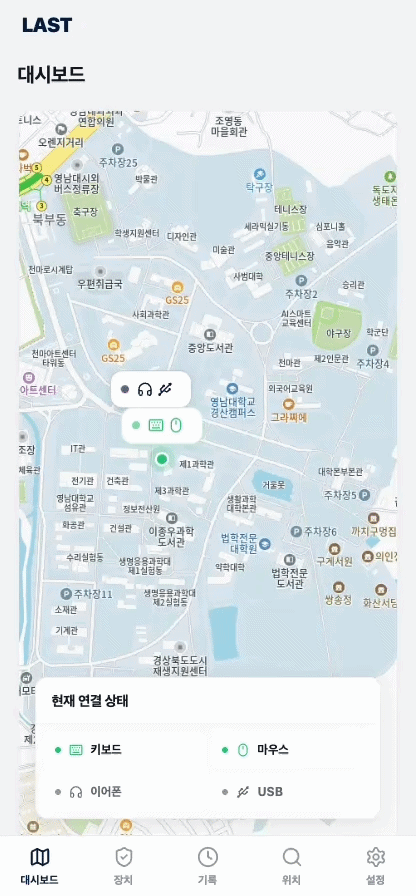
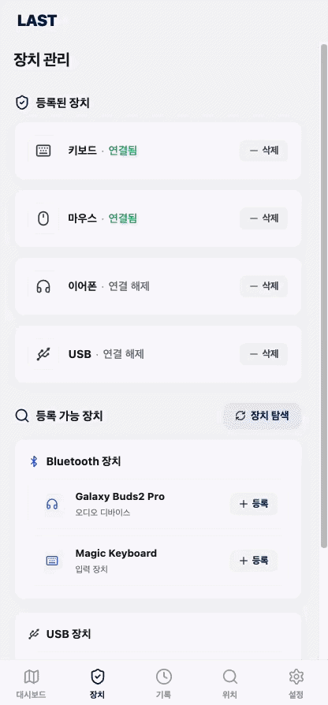
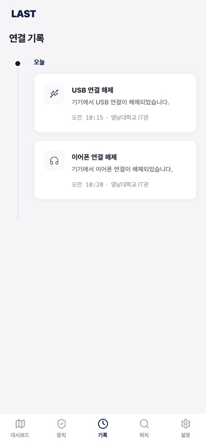
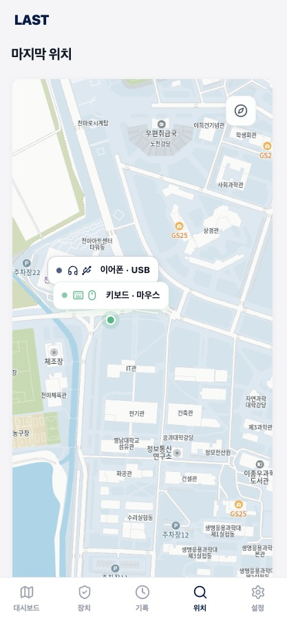
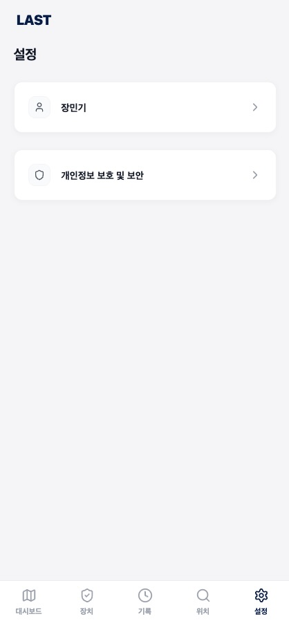

# Analysis

  

| No  | 22212058  |
| --- | --- |
| Name | 장민기 |
| E-mail | mingijang@yu.ac.kr |

---

# Revision history

| Revision date  | Version #  | Description  | Anthor  |
| --- | --- | --- | --- |
| 2026년 6월 10일 수요일  | v1.0 | MVVM + Flow + 트랜잭션 | 장민기 |
| 2026년 6월 10일 수요일  | v1.2 | FGS · 장치매칭 · POWER 분리 | 장민기 |
| 2026년 6월 10일 수요일  | v1.4 | 대시보드 개편 · BT 모니터링 | 장민기 |
| 2026년 6월 13일 토요일  | v2.0 | DSA 인덱스 · 패키지 구조 정리 | 장민기 |
| 2026년 6월 13일 토요일  | v2.0 | WAL · 부분 인덱스 · ANR 수정 | 장민기 |
| 2026년 6월 13일 토요일  | v2.0 | DB 캐시 테이블 · DSA/DB 최적화 | 장민기 |
| 2026년 6월 15일 월요일  | v2.0.2 | 설정·백업·구조 정리 | 장민기 |
| 2026년 6월 15일 월요일  | v2.0.3 | BT 추적 수정 · 파일명/패키지 최적화 · 데드코드 제거 | 장민기 |

---

# Contents

1. Introduction
2. Use case analysis
3. Domain analysis
4. User Interface prototype
5. Glossary
6. References

---

# 1. Introduction

## **1) Summary**

스마트폰 사용자들은 무선 이어폰, 스마트워치, 충전기, USB-C 메모리와 같은 다양한 주변기기를 사용한다. 그러나 카페, 도서관, 대중교통, 사무실 등의 장소에서 주변기기를 두고 이동하는 경우가 자주 발생하며, 분실 이후 마지막 사용 위치를 기억하지 못해 장비를 찾는데 어려움을 겪는다.

LAST(Last Accessed Smart Tracker)는 이러한 문제를 해결하기 위해 개발된 Android 기반 USB 및 Bluetooth 주변기기 관리 앱이다. 본 시스템은 USB 및 Bluetooth 주변기기의 연결 상태를 감지하고, 연결 해제 시점의 위치와 시간을 자동으로 기록한다. 사용자는 저장된 정보를 통해 주변기기의 마지막 사용 위치와 연결 이력을 확인할 수 있으며, 이를 통해 분실 가능성을 줄이고 장비 관리의 편의성을 향상시킬 수 있다.

또한 별도의 추적 장치 없이 운영체제에서 제공하는 장치 이벤트와 위치 서비스를 활용하여 주변기기의 마지막 사용 정보를 기록한다는 점에서 기존 위치 추적 방식과 차별성을 가진다.

## **2) Describe the Features of Project**

LAST는 사용자가 주변기기의 마지막 사용 위치와 연결 이력을 확인할 수 있도록 지원하는 시스템이다. 사용자는 주변기기를 등록하여 관리할 수 있으며, 장치의 연결 상태를 확인하고 연결 해제 시점의 위치 정보와 연결 기록을 조회할 수 있다.

## **3) Analysis Overview**

본 Analysis Document에서는 시스템이 제공하는 기능과 동작 방식을 분석하기 위하여 Use Case Analysis, Domain Analysis, Application Analysis 및 User Interface Prototype을 수행한다. 이를 통해 시스템의 기능적 요구사항과 주요 객체 간의 관계를 분석하고, 사용자 관점에서의 시스템 동작을 구체적으로 설명한다.

---

# 2. Use case analysis

### **2.1 Use Case Diagram**

LAST(Last Accessed Smart Tracker) 시스템은 사용자가 USB 및 Bluetooth 기반 주변기기의 상태를 관리하고 마지막 사용 위치를 확인할 수 있도록 지원하는 시스템이다.

Use Case Diagram은 Conceptualization Document에서 정의한 기능 요구사항을 기반으로 작성하였다. 본 시스템의 주요 Actor는 User이며, 사용자는 주변기기 등록, 상태 조회, 마지막 위치 확인, 연결 기록 조회 및 시스템 설정 관리 기능을 수행할 수 있다.

각 Use Case는 사용자의 목표(User Goal)를 중심으로 도출하였으며, 시스템 내부 동작은 제외하고 사용자가 직접 수행하거나 확인할 수 있는 기능만을 표현하였다.

  

---

### **2.2 Use Case Description**

### UC-01 Register Device

### General Characteristics

| Item  | Description  |
| --- | --- |
| Use Case Name | Register Device |
| Scope | LAST System |
| Level | User Level |
| Primary Actor | User |
| Summary | 사용자가 새로운 USB 또는 Bluetooth 주변기기를 등록한다. |
| Preconditions | 시스템이 실행 중이어야 하며 등록 가능한 장치가 존재해야 한다. |
| Trigger | 사용자가 장치 등록 기능을 선택한다. |
| Success Post Condition | 선택한 장치가 정상적으로 등록된다. |
| Failed Post Condition | 장치 등록에 실패한다. |

### Main Success Scenario

| Step  | Description  |
| --- | --- |
| 1 | 사용자가 장치 등록 기능을 선택한다. |
| 2 | 시스템이 연결 가능한 장치를 검색한다. |
| 3 | 검색된 장치 목록을 표시한다. |
| 4 | 사용자가 등록할 장치를 선택한다. |
| 5 | 시스템이 장치 정보를 저장한다. |
| 6 | 등록 완료 메시지를 출력한다. |

### Extension Scenario

2a. Bluetooth 기능이 비활성화된 경우

- 시스템은 Bluetooth 활성화를 요청한다.

2b. USB 장치를 인식할 수 없는 경우

- 시스템은 장치 인식 실패 메시지를 출력한다.

5a. 장치 정보 저장에 실패한 경우

- 시스템은 등록 실패 메시지를 출력한다.

---

### UC-02 View Device Status

### General Characteristics

| Item  | Description  |
| --- | --- |
| Use Case Name | View Device Status |
| Scope | LAST System |
| Level | User Level |
| Primary Actor | User |
| Summary | 등록된 주변기기의 현재 연결 상태를 조회한다. |
| Preconditions | 사용자가 하나 이상의 주변기기를 등록한 상태여야 한다. |
| Trigger | 사용자가 장치 상태 조회 기능을 선택한다. |
| Success Post Condition | 선택한 장치의 현재 연결 상태가 표시된다. |
| Failed Post Condition | 장치 상태 조회에 실패한다. |

### Main Success Scenario

| Step  | Description  |
| --- | --- |
| 1 | 사용자가 등록된 장치 목록을 조회한다. |
| 2 | 시스템이 등록된 장치 정보를 불러온다. |
| 3 | 사용자가 특정 장치를 선택한다. |
| 4 | 시스템이 현재 연결 상태를 확인한다. |
| 5 | 시스템이 연결 상태 정보를 표시한다. |
| 6 | 사용자가 상태 정보를 확인한다. |

### Extension Scenario

2a. 등록된 장치가 존재하지 않는 경우

- 시스템은 등록된 장치가 없음을 알린다.

4a. 장치 상태를 확인할 수 없는 경우

- 시스템은 상태 조회 실패 메시지를 출력한다.

---

### UC-03 View Last Location

### General Characteristics

| Item  | Description  |
| --- | --- |
| Use Case Name | View Last Location |
| Scope | LAST System |
| Level | User Level |
| Primary Actor | User |
| Summary | 주변기기의 마지막 사용 위치를 조회한다. |
| Preconditions | 조회하려는 장치가 등록되어 있으며 위치 정보가 저장되어 있어야 한다. |
| Trigger | 사용자가 마지막 위치 조회 기능을 선택한다. |
| Success Post Condition | 마지막 위치 정보가 정상적으로 표시된다. |
| Failed Post Condition | 위치 조회에 실패한다. |

### Main Success Scenario

| Step  | Description  |
| --- | --- |
| 1 | 사용자가 등록된 장치를 선택한다. |
| 2 | 마지막 위치 조회 기능을 실행한다. |
| 3 | 시스템이 저장된 위치 정보를 검색한다. |
| 4 | 시스템이 지도 화면에 위치를 표시한다. |
| 5 | 위치 정보와 저장 시간을 함께 표시한다. |
| 6 | 사용자가 위치 정보를 확인한다. |

### Extension Scenario

3a. 저장된 위치 정보가 존재하지 않는 경우

- 시스템은 위치 정보가 존재하지 않음을 알린다.

4a. 위치 서비스 권한이 비활성화된 경우

- 시스템은 위치 권한 설정을 요청한다.

4b. 지도 서비스 로딩에 실패한 경우

- 시스템은 위치 표시 실패 메시지를 출력한다.

---

### UC-04 View Connection History

### General Characteristics

| Item  | Description  |
| --- | --- |
| Use Case Name | View Connection History |
| Scope | LAST System |
| Level | User Level |
| Primary Actor | User |
| Summary | 주변기기의 연결 및 연결 해제 기록을 조회한다. |
| Preconditions | 조회하려는 장치가 등록되어 있어야 한다. |
| Trigger | 사용자가 연결 기록 조회 기능을 선택한다. |
| Success Post Condition | 연결 기록이 정상적으로 표시된다. |
| Failed Post Condition | 연결 기록 조회에 실패한다. |

### Main Success Scenario

| Step  | Description  |
| --- | --- |
| 1 | 사용자가 등록된 장치를 선택한다. |
| 2 | 연결 기록 조회 기능을 실행한다. |
| 3 | 시스템이 저장된 이벤트 로그를 조회한다. |
| 4 | 연결 및 연결 해제 기록을 시간순으로 정렬한다. |
| 5 | 기록 목록을 화면에 표시한다. |
| 6 | 사용자가 기록 정보를 확인한다. |

### Extension Scenario

3a. 저장된 연결 기록이 존재하지 않는 경우

- 시스템은 연결 기록이 존재하지 않음을 알린다.

5a. 로그 조회 중 오류가 발생한 경우

- 시스템은 조회 실패 메시지를 출력한다.

---

### UC-05 Manage Settings

### General Characteristics

| Item  | Description  |
| --- | --- |
| Use Case Name | Manage Settings |
| Scope | LAST System |
| Level | User Level |
| Primary Actor | User |
| Summary | 시스템 설정을 변경하고 저장한다. |
| Preconditions | 사용자가 시스템에 접근할 수 있어야 한다. |
| Trigger | 사용자가 설정 메뉴를 선택한다. |
| Success Post Condition | 변경된 설정이 저장된다. |
| Failed Post Condition | 설정 저장에 실패한다. |

### Main Success Scenario

| Step  | Description  |
| --- | --- |
| 1 | 사용자가 설정 메뉴를 선택한다. |
| 2 | 시스템이 현재 설정 값을 표시한다. |
| 3 | 사용자가 위치 서비스, 알림 기능 및 자동 모니터링 옵션을 변경한다. |
| 4 | 사용자가 저장 버튼을 선택한다. |
| 5 | 시스템이 변경된 설정을 저장한다. |
| 6 | 저장 완료 메시지를 출력한다. |

### Extension Scenario

3a. 잘못된 설정 값이 입력된 경우

- 시스템은 올바른 값을 입력하도록 안내한다.

5a. 설정 저장에 실패한 경우

- 시스템은 저장 실패 메시지를 출력한다.

---

# 3. **Domain Analysis**

## 3.1 Domain Model

Domain Model은 시스템이 다루는 핵심 개념과 객체 간의 관계를 분석하기 위한 모델이다. 본 모델은 Use Case Analysis에서 도출된 요구사항을 기반으로 작성되었으며, 사용자가 주변기기를 등록하고 상태를 확인하며 마지막 사용 위치와 연결 기록을 조회하는 과정에서 필요한 핵심 개념들을 정의한다.

LAST(Last Accessed Smart Tracker) 시스템의 주요 Domain Object는 User, Device, ConnectionEvent 및 Settings로 구성된다.

- User는 LAST 시스템을 사용하는 사용자를 나타낸다.
- Device는 사용자가 등록한 USB 또는 Bluetooth 주변기기를 나타낸다.
- ConnectionEvent는 장치의 연결 및 연결 해제 이벤트와 해당 시점의 위치 정보를 기록하는 객체이다.
- Settings는 사용자의 시스템 환경설정 정보를 나타낸다.

본 Domain Model은 시스템의 핵심 개념을 중심으로 구성하였으며, 구현 세부사항이나 기술적인 요소는 제외하였다.

---

## 3.2 Domain Class Description

### User

User는 LAST 시스템을 사용하는 사용자를 나타낸다. 사용자는 주변기기를 등록하고 관리하며, 등록된 장치의 상태 조회, 마지막 사용 위치 조회 및 연결 기록 조회 기능을 수행할 수 있다.

| Attribute  | Description  |
| --- | --- |
| userId | 사용자 식별자 |
| userName | 사용자 이름 |

---

### Device

Device는 사용자가 등록한 USB 또는 Bluetooth 주변기기를 나타낸다. 사용자는 하나 이상의 장치를 등록할 수 있으며, 각 장치는 연결 상태와 사용 이력을 가진다.

| Attribute  | Description  |
| --- | --- |
| deviceId | 장치 식별자 |
| deviceName | 장치 이름 |
| deviceType | 장치 유형 |
| status | 현재 연결 상태 |

---

### ConnectionEvent

ConnectionEvent는 장치의 연결 및 연결 해제 이벤트를 기록하는 핵심 객체이다. 각 이벤트는 발생 시간과 위치 정보를 포함하며, 마지막 사용 위치 조회 및 연결 기록 조회 기능의 기반 데이터로 활용된다.

| Attribute  | Description  |
| --- | --- |
| eventId | 이벤트 식별자 |
| eventType | 연결 또는 연결 해제 유형 |
| eventTime | 이벤트 발생 시간 |
| latitude | 위치 위도 |
| longitude | 위치 경도 |

---

### Settings

Settings는 사용자의 시스템 환경설정을 관리하는 객체이다. 사용자는 위치 추적 기능 및 관련 옵션을 설정할 수 있으며, 시스템은 저장된 설정 정보를 기반으로 동작한다.

| Attribute  | Description  |
| --- | --- |
| notificationEnabled | 알림 사용 여부 |
| locationTrackingEnabled | 위치 추적 사용 여부 |

---

## 3.3 Relationship Description

### User – Device

한 명의 사용자는 여러 개의 주변기기를 등록하고 관리할 수 있으며, 각 주변기기는 하나의 사용자에게 소속된다. 사용자는 등록된 장치를 대상으로 상태 조회, 마지막 위치 조회 및 연결 기록 조회 기능을 수행한다.

<aside>

Relationship

User 1 ----- * Device

</aside>

---

### Device – ConnectionEvent

하나의 장치는 사용 과정에서 여러 번 연결 및 연결 해제될 수 있으며, 각 연결 상태 변화는 ConnectionEvent로 기록된다. 저장된 이벤트 정보는 연결 기록 조회 및 마지막 사용 위치 확인 기능에 활용된다.

<aside>

Relationship

Device 1 ----- * ConnectionEvent

</aside>

---

### User – Settings

한 명의 사용자는 하나의 설정 정보를 가지며, 시스템은 해당 설정을 기반으로 위치 추적 및 관련 기능을 수행한다.

<aside>

Relationship

User 1 ----- 1 Settings

</aside>

---

## 3.4 Domain Model Summary

본 Domain Model은 LAST 시스템의 핵심 개념인 User, Device, ConnectionEvent 및 Settings를 중심으로 구성하였다.

사용자는 여러 개의 주변기기를 등록하여 관리할 수 있으며, 각 장치는 사용 과정에서 발생하는 연결 및 연결 해제 이벤트를 기록한다. ConnectionEvent는 이벤트 발생 시간과 위치 정보를 함께 저장하여 마지막 사용 위치 조회와 연결 기록 조회 기능을 지원한다.

또한 사용자는 Settings를 통해 위치 추적 및 시스템 설정을 관리할 수 있으며, 저장된 설정 정보는 시스템 동작에 반영된다.

본 Domain Model은 LAST 시스템의 핵심 개념과 객체 간의 관계를 표현하기 위해 구성되었으며, 구현 세부사항은 포함하지 않는다.

---

# 4. **User Interface Prototype**

## Figma

### [https://www.figma.com/make/lmrrotitdEdd1ooxrQY8s2/LAST?t=w2yk2MhOTOwTxxM9-20&fullscreen=1](https://www.figma.com/make/lmrrotitdEdd1ooxrQY8s2/LAST?t=OAPh6GlUVmDhAQDL-1&preview-route=%2Fsettings)

---

## **4.1 Dashboard**

  

Dashboard는 사용자가 LAST 앱 실행 시 가장 먼저 확인하는 메인 화면이다. 등록된 주변기기의 상태와 최근 연결 정보를 한눈에 확인할 수 있으며, 마지막 사용 위치 정보를 우선적으로 제공하여 사용자가 장치의 현재 상태를 빠르게 파악할 수 있도록 구성하였다.

사용자는 Dashboard를 통해 마지막 사용 위치, 최근 연결 및 연결 해제 이벤트, 현재 연결 상태를 확인할 수 있다. 또한 등록된 장치 정보를 조회하고 다른 기능 화면으로 이동할 수 있다.

ex)

- 마지막 사용 위치
- 최근 연결 및 연결 해제 이벤트
- 현재 연결 상태
- 등록된 주변기기 수
- 주요 기능 메뉴

---

## **4.2 Device Management**

  

Device Management는 사용자가 새로운 주변기기를 등록하기 위한 화면이다. 시스템은 현재 연결 가능한 USB 및 Bluetooth 장치를 탐색하여 제공하며, 사용자는 원하는 장치를 선택하여 등록할 수 있다.

사용자는 Device Management를 통해 등록된 장치 목록을 확인하고 새로운 장치를 등록할 수 있다. 또한 탐색된 장치 정보를 확인하여 등록 가능한 장치를 탐색할 수 있다.

ex)

- 등록된 장치 목록
- Bluetooth 장치 목록
- USB 장치 목록
- 장치 등록 기능
- 장치 탐색 기능

---

## **4.3 Connection History**

  

Connection History는 사용자가 주변기기의 연결 이력을 확인하기 위한 화면이다. 사용자는 저장된 연결 이력을 조회하여 장치의 연결 및 연결 해제 기록을 확인할 수 있다.

사용자는 Connection History를 통해 특정 장치의 연결 상태 변화와 이벤트 발생 시간을 확인할 수 있다. 또한 연결 이력을 조회하여 장치의 사용 기록을 파악할 수 있다.

ex)

- 연결 이력 목록
- 이벤트 발생 시간
- 이벤트 유형
- 장치 정보
- 연결 이력 조회 기능

---

## **4.4 Last Location**

  

Last Location은 사용자가 주변기기의 마지막 사용 위치를 확인하기 위한 화면이다. 사용자는 저장된 위치 정보를 조회하여 장치가 마지막으로 사용된 위치를 확인할 수 있다.

사용자는 Last Location을 통해 특정 장치의 마지막 위치와 마지막 확인 시간을 확인할 수 있다. 또한 위치 정보를 활용하여 장치의 마지막 사용 위치를 파악할 수 있다.

ex)

- 마지막 위치
- 마지막 확인 시간
- 장치 정보
- 지도 정보
- 장치 선택 기능

---

## **4.5 Settings**

  

Settings는 사용자가 시스템 환경을 설정하기 위한 화면이다. 사용자는 시스템 사용에 필요한 설정 정보를 확인하고 변경할 수 있다.

사용자는 Settings를 통해 장치 탐색 설정, 알림 설정 및 시스템 환경 설정을 확인하고 변경할 수 있다. 또한 변경된 설정 정보를 저장하여 개인 환경에 맞게 시스템을 사용할 수 있다.

ex)

- 장치 탐색 설정
- 알림 설정
- 시스템 환경 설정
- 설정 변경 기능
- 설정 저장 기능

---

# 5. Glossary

본 절에서는 LAST(Last Accessed Smart Tracker) 시스템에서 사용되는 주요 용어를 정의한다. Glossary는 프로젝트 전반에서 사용되는 핵심 개념을 일관되게 이해하기 위해 작성되었다.

| Term  | Definition  |
| --- | --- |
| LAST | Last Accessed Smart Tracker의 약자로, 주변기기의 마지막 사용 위치와 연결 이력을 기록하고 조회할 수 있도록 지원하는 Android 앱 |
| User | LAST 시스템을 사용하는 사용자 |
| Device | 사용자가 등록하여 관리하는 USB 또는 Bluetooth 기반 주변기기 |
| Registered Device | 시스템에 등록되어 관리 대상이 된 주변기기 |
| Bluetooth Device | Bluetooth 인터페이스를 통해 연결되는 무선 주변기기 |
| USB Device | USB-C 포트를 통해 연결되는 충전기 및 유선 주변기기 |
| Device Status | 주변기기의 현재 연결 상태를 나타내는 정보 |
| Connection Event | 장치의 연결 또는 연결 해제 시 발생하는 이벤트 |
| Connection History | 장치의 연결 및 연결 해제 이력을 저장한 기록 정보 |
| Last Location | 장치가 마지막으로 사용되거나 연결 해제된 시점의 위치 정보 |
| Location Tracking | 장치 연결 해제 시 위치 정보를 저장하는 기능 |
| Location Service | 운영체제가 제공하는 위치 정보 수집 서비스로, LAST 시스템의 위치 저장 기능을 지원하는 서비스 |
| Event Log | 연결 이벤트와 관련 정보를 저장한 기록 데이터 |
| Settings | 위치 추적 및 알림 기능과 관련된 시스템 환경설정 정보 |

## Summary

본 Glossary는 LAST 시스템의 핵심 개념을 중심으로 구성하였다. 정의된 용어들은 Use Case Analysis, Domain Analysis 및 User Interface Prototype에서 공통적으로 사용되는 주요 개념들로, 문서 전반의 일관성을 유지하기 위해 작성되었다. 특히 Device, Connection Event, Connection History 및 Last Location은 시스템의 핵심 기능과 직접적으로 연관되는 주요 용어이며, 사용자가 시스템을 이해하는 데 필요한 기본 개념을 제공한다.

---

# 6. References

[1] Android Developer Documentation

Purpose : Android 시스템 구조 및 장치 연결 이벤트 처리 방식 참고

Source : Google LLC

Link : [https://developer.android.com/](https://developer.android.com/)

[2] Android Bluetooth (BluetoothManager) API Documentation

Purpose : Bluetooth 장치 연결 상태 감지 및 이벤트 처리 방식 조사

Source : Android Developer Documentation

[3] Android Location (FusedLocationProvider) API Documentation

Purpose : 위치 정보 수집 및 마지막 사용 위치 저장 기능 조사

[4] UML 2.5.1 Specification

Purpose : Use Case Diagram, Domain Model 및 UML 모델링 작성 기준 참고

Source : Object Management Group (OMG)

Link : [https://www.omg.org/spec/UML/](https://www.omg.org/spec/UML/)

[5] Software Design Lecture Materials

Purpose : Use Case Analysis, Domain Analysis, Glossary 및 UML 작성 기준 참고

Source : Software Design Course Materials

[6] Analysis Example Documents

Purpose : Use Case Description, Domain Analysis, Glossary 및 문서 구성 형식 참고

Source : Course Example Documents

[7] Android USB Host & Accessory (UsbManager) API Documentation

Purpose : USB 장치 연결 및 시스템 이벤트 처리 방식 조사

## Reference Summary

본 프로젝트는 Android Developer Documentation을 중심으로 Bluetooth 및 USB 장치 관리 및 위치 정보 수집 기능과 관련된 기술 자료를 참고하였다. 또한 UML 모델링을 위해 OMG UML Specification을 활용하였으며, 강의자료와 제공된 예시 문서를 기반으로 Use Case Analysis, Domain Analysis, Glossary 및 UML 문서를 작성하였다.

공식 문서를 우선적으로 활용하여 기술적 타당성을 확보하였으며, 강의자료와 예시 문서를 참고하여 문서 형식 및 모델링 규칙의 일관성을 유지하였다.

---
