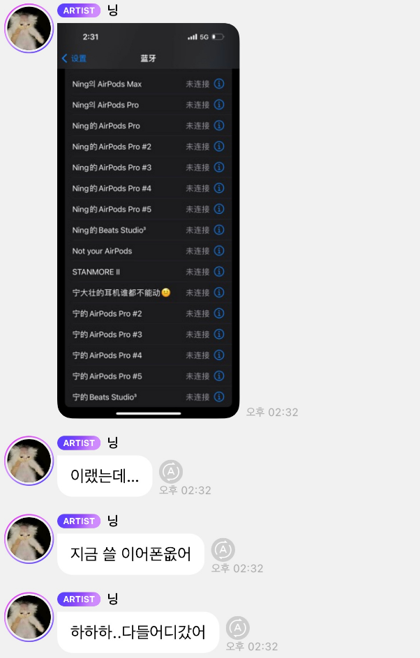
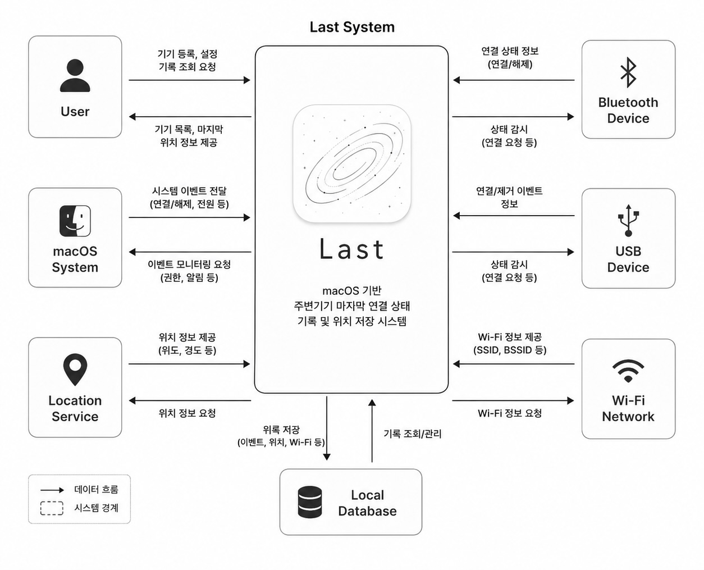

# Conceptualization

  

| No | 22212058 |
| --- | --- |
| Name | 장민기 |
| E-mail | mingijang@yu.ac.kr |

---

# Revision history

| Revision date | Version # | Description | Anthor |
| --- | --- | --- | --- |
|  |  |  |  |
|  |  |  |  |
|  |  |  |  |
|  |  |  |  |
|  |  |  |  |

---

# Contents

1. Business purpose
2. System context diagram
3. Use case list
4. Concept of operation
5. Problem statement
6. Glossary
7. References

---

# Business purpose

 대학생들은 강의실, 실습실, 도서관, 카페 등 다양한 환경에서 충전기, USB, 마우스, 키보드와 같은 주변기기를 자주 사용한다. 그러나 잦은 이동과 복잡한 학업 환경으로 인해 사용 후 주변기기를 두고 오거나 분실하는 상황이 빈번하게 발생한다. 실제로 본인 또한 실습실에서 블루투스 마우스를 두고 와 다시 찾으러 간 경험이 여러 차례 있었으며, 이러한 경험은 대학생 사용자들에게 매우 흔하게 발생하는 문제이다.

 최근에는 유명 연예인인 에스파(aespa)의 멤버 닝닝 또한 AirPods을 분실한 경험을 공유하면서 많은 사용자들의 공감을 얻은 사례가 있었다. 이처럼 작은 주변기기의 분실은 일상 속에서 빈번하게 발생하지만, 사용자는 기기를 마지막으로 어디에서 사용했는지 정확히 기억하지 못하는 경우가 많다. 특히 소형 주변기기의 경우 노트북과 연결이 해제된 이후에는 위치를 확인하기 어렵기 때문에 사용자에게 불편함과 추가적인 비용 부담을 유발한다.

  

 현재 Apple의 “나의 찾기(Find My)” 서비스는 일부 인증된 기기에 대해서만 위치 추적 기능을 제공하고 있으며, 일반적인 USB 장치나 비인증 블루투스 주변기기, 충전기 등은 기존 시스템을 통해 추적하기 어렵다. 따라서 사용자는 주변기기를 어디에서 마지막으로 사용했는지 확인할 수 있는 수단이 부족한 상황이다.

 본 프로젝트에서는 이러한 문제를 해결하기 위해 macOS 기반의 백그라운드 모니터링 시스템인 **Last**를 제안한다. Last는 블루투스, USB, 충전 연결 상태와 같은 시스템 이벤트를 지속적으로 감시하고, 기기의 연결이 종료되는 순간 시간, 마지막 위치 정보, Wi-Fi 정보 등을 자동으로 기록하는 기능을 제공한다.

 본 시스템은 실시간 위치 추적보다는 주변기기의 “마지막 연결 상태”를 기록하는 것에 중점을 둔다. 이를 통해 사용자는 기기를 분실했을 때 마지막으로 사용한 장소와 환경을 확인할 수 있으며, 주변기기를 보다 효율적으로 찾을 수 있다. 또한 시스템 이벤트 기반 기록 방식과 백그라운드 모니터링 기술을 활용하여 실제 사용자 환경에서 활용 가능한 분실 방지 보조 시스템을 구현하는 것을 목표로 한다.

 본 프로젝트의 주요 대상은 다양한 주변기기를 사용하는 대학생 및 노트북 사용자이며, 이동이 많은 환경에서 발생하는 주변기기 분실 문제를 줄이고 사용자 편의성을 향상시키는 것을 목표로 한다.

---

# 2. System context diagram

  

---

# 3. Use Case List

1. Register Device

| Actor | User |
| --- | --- |
| Description | 사용자가 블루투스 장치 또는 USB 장치를 시스템에 등록하고 관리 |
1. Monitor Device Connection

| Actor | Last System |
| --- | --- |
| Description | 등록된 주변기기의 연결 상태를 백그라운드에서 지속적으로 감시 |
2. Detect Disconnect Event

| Actor | macOS System, Last System |
| --- | --- |
| Description | 시스템이 블루투스, USB, 충전 연결 해제 이벤트를 감지 |
3. Save Last Location

| Actor | Last System, Location Service |
| --- | --- |
| Description | 연결 종료 이벤트 발생 시 마지막 위치 정보와 Wi-Fi 정보를 저장 |
4. View Device History

| Actor | User |
| --- | --- |
| Description | 사용자가 저장된 주변기기 기록 및 이벤트 내역을 조회 |
5. View Last Location

| Actor | User |
| --- | --- |
| Description | 사용자가 마지막으로 기록된 주변기기의 위치 정보를 확인 |
6. Save System Log

| Actor | Last System, Local Database |
| --- | --- |
| Description | 이벤트 기록, 위치 정보, Wi-Fi 정보를 로컬 데이터베이스에 저장 |

---

# 4. Concept of Operation

1. Register Device

| Purpose | 사용자가 추적할 주변기기를 시스템에 등록하기 위함 |
| --- | --- |
| Approach | 사용자가 블루투스 또는 USB 장치를 선택하여 등록 |
| Dynamics | 앱 실행 후 기기를 등록할 경우 |
| Goals | 사용자의 주변기기를 관리 가능한 상태로 등록 |
3. Monitor Device Connection

| Purpose | 등록된 주변기기의 연결 상태를 지속적으로 확인하기 위함 |
| --- | --- |
| Approach | macOS 백그라운드 환경에서 연결 상태 이벤트를 모니터링 |
| Dynamics | 시스템이 백그라운드에서 실행 중일 경우 |
| Goals | 주변기기의 연결 및 해제 상태를 실시간으로 감시 |
3. Detect Disconnect Event

| Purpose | 주변기기의 연결 종료 순간을 감지하기 위함 |
| --- | --- |
| Approach | Bluetooth, USB, 충전 해제 이벤트를 시스템 이벤트 기반으로 감지 |
| Dynamics | 주변기기의 연결이 해제될 경우 |
| Goals | 분실 가능성이 있는 마지막 연결 종료 시점을 기록 |
4. Save Last Location

| Purpose | 마지막 연결 종료 위치를 저장하기 위함 |
| --- | --- |
| Approach | 위치 서비스 및 Wi-Fi 정보를 활용하여 현재 환경 정보를 기록 |
| Dynamics | 연결 종료 이벤트 발생 시 |
| Goals | 사용자가 마지막 사용 위치를 확인할 수 있도록 지원 |
5. View Device History

| Purpose | 사용자가 저장된 기록을 확인하기 위함 |
| --- | --- |
| Approach | 사용자 요청 시 저장된 이벤트 로그를 불러옴 |
| Dynamics | 사용자가 기록 조회를 요청할 경우 |
| Goals | 주변기기의 사용 기록 및 연결 종료 내역을 제공 |
6. View Last Location

| Purpose | 사용자가 마지막 위치를 확인하기 위함 |
| --- | --- |
| Approach | 저장된 위치 데이터를 지도 기반 인터페이스로 표시 |
| Dynamics | 사용자가 특정 기기를 선택할 경우 |
| Goals | 사용자가 주변기기를 보다 쉽게 찾을 수 있도록 지원 |
1. Save System Log

| Purpose | 이벤트 및 위치 기록 정보를 저장하기 위함 |
| --- | --- |
| Approach | 시스템이 이벤트 발생 시 데이터를 로컬 데이터베이스에 저장 |
| Dynamics | 연결 종료 이벤트 또는 위치 기록 발생 시 |
| Goals | 주변기기의 마지막 상태 및 기록 정보를 유지 |

---

# 5. Problem Statement

1. 시스템 종료 이후 이벤트 감지 한계

| Problem | 시스템 종료 이후 발생하는 이벤트는 감지할 수 없음 |
| --- | --- |
| Example | 노트북 종료 후 충전기를 제거하는 경우 |
| Consideration | 시스템 종료 직전 마지막 연결 상태 및 위치 정보를 저장하도록 설계 |
2. 블루투스 연결 해제 신뢰성 문제

| Problem | 블루투스 장치가 일시적으로 연결 해제될 수 있음 |
| --- | --- |
| Example | 일시적인 끊김, 절전 모드 |
| Consideration | 단순 연결 해제만으로 분실 여부를 판단하지 않도록 설계 |
3. 실내 위치 정확도 문제

| Problem | 실내 환경에서 GPS 정확도가 낮음 |
| --- | --- |
| Example | 건물 내부 위치 오차 발생 |
| Consideration | Wi-Fi 정보(SSID, BSSID)를 함께 저장하여 위치 정확도 보완 |
4. macOS 백그라운드 권한 제한

| Problem | macOS의 백그라운드 권한 및 시스템 접근 제한 |
| --- | --- |
| Example | Bluetooth 및 위치 권한 필요 |
| Consideration | 사용자 권한 요청 및 안정적인 백그라운드 동작 고려 |
5. Non-Functional Requirements (NFRs)

| 안정성 | 시스템은 백그라운드 환경에서 안정적으로 동작해야 함 |
| --- | --- |
| 성능 | 이벤트 발생 시 빠르게 위치 및 연결 정보를 기록해야 함 |
| 보안성 | 사용자 위치 및 기록 데이터는 안전하게 저장되어야 함 |
| 효율성 | 최소한의 시스템 자원을 사용해야 함 |
| 사용성 | 사용자 인터페이스는 직관적이고 간단해야 함 |
| 신뢰성 | 마지막 상태 기록 기능이 안정적으로 유지되어야 함 |

---

# 6. Glossary

| Last | 주변기기의 마지막 연결 상태와 위치를 기록하는 macOS 기반 시스템 |
| --- | --- |
| Peripheral Device | 마우스, 키보드, USB, 충전기 등 노트북 주변기기 |
| Disconnect Event | 주변기기의 연결이 종료되는 시스템 이벤트 |
| Bluetooth Device | Bluetooth 기반으로 연결되는 무선 주변기기 |
| USB Device | USB 포트를 통해 연결되는 장치 |
| Background Monitoring | 시스템이 백그라운드에서 지속적으로 연결 상태를 감시하는 기능 |
| Last Location | 주변기기의 마지막 연결 종료 위치 정보 |
| Wi-Fi Information | 위치 보조를 위해 저장되는 Wi-Fi SSID 및 네트워크 정보 |
| Event Log | 연결 종료 시간, 위치, 장치 정보 등을 저장한 기록 데이터 |
| Local Database | 이벤트 및 위치 기록을 저장하는 로컬 저장소 |
| macOS System Event | macOS에서 발생하는 연결/해제 관련 시스템 이벤트 |
| Location Service | 현재 위치 정보를 제공하는 시스템 서비스 |
| NFRs | 시스템 성능, 안정성, 보안성 등 기능 외 요구사항 |
| Real-Time Tracking | 기기의 현재 위치를 실시간으로 추적하는 방식 |
| Last State Recording | 마지막 연결 상태를 저장하는 기록 기반 방식 |

---

# 7. References

> 본 프로젝트는 macOS 시스템 이벤트 처리, Bluetooth 연결 구조, 위치 서비스 및 백그라운드 권한 제한 등을 조사하기 위해 아래 자료를 참고하였다.
> 
1. Apple Developer Documentation
    - Purpose : macOS 백그라운드 시스템 구조 및 권한 처리 방식 참고
    - Link        : [https://developer.apple.com/documentation/](https://developer.apple.com/documentation/)
2. CoreBluetooth Framework
    - Purpose : Bluetooth 연결 상태 및 Disconnect Event 감지 방법 조사
    - Link        : [https://developer.apple.com/documentation/corebluetooth](https://developer.apple.com/documentation/corebluetooth)
3. CoreLocation Framework
    - Purpose : 마지막 위치 기록 및 위치 서비스 처리 방식 참고
    - Link        : [https://developer.apple.com/documentation/corelocation](https://developer.apple.com/documentation/corelocation)
4. MapKit Framework
    - Purpose : 사용자에게 마지막 위치를 지도 형태로 제공하는 방법 조사
    - Link        : [https://developer.apple.com/documentation/mapkit](https://developer.apple.com/documentation/mapkit)
5. Apple Find My Service
    - Purpose : 기존 Apple 위치 추적 서비스의 기능 및 한계 분석
    - Link        : [https://www.apple.com/icloud/find-my/](https://www.apple.com/icloud/find-my/)
6. Bluetooth Low Energy (BLE) Documentation
    - Purpose : BLE 장치 연결 해제 시 발생 가능한 이벤트 구조 조사
    - Link        : [https://developer.apple.com/bluetooth/](https://developer.apple.com/bluetooth/)
7. Wi-Fi Network Information
    - Purpose : GPS 정확도 문제를 보완하기 위한 Wi-Fi 기반 위치 보조 방법 조사
    - Link        : [https://developer.apple.com/documentation/systemconfiguration](https://developer.apple.com/documentation/systemconfiguration)
8. USB Device Handling
    - Purpose : USB 연결/제거 이벤트 처리 방식 및 시스템 이벤트 구조 조사
    - Link        : [https://developer.apple.com/documentation/iokit](https://developer.apple.com/documentation/iokit)
9. Apple Human Interface Guidelines
    - Purpose : macOS 환경에 적합한 미니멀 UI/UX 디자인 참고
    - Link        : [https://developer.apple.com/design/human-interface-guidelines/](https://developer.apple.com/design/human-interface-guidelines/)
10. Peripheral Device Loss Cases
    - Purpose : 실제 주변기기 분실 사례 및 사용자 경험 기반 문제 상황 분석
    - Link        : [https://support.apple.com/airpods](https://support.apple.com/airpods)

---
