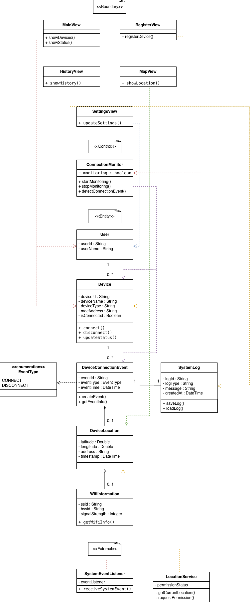
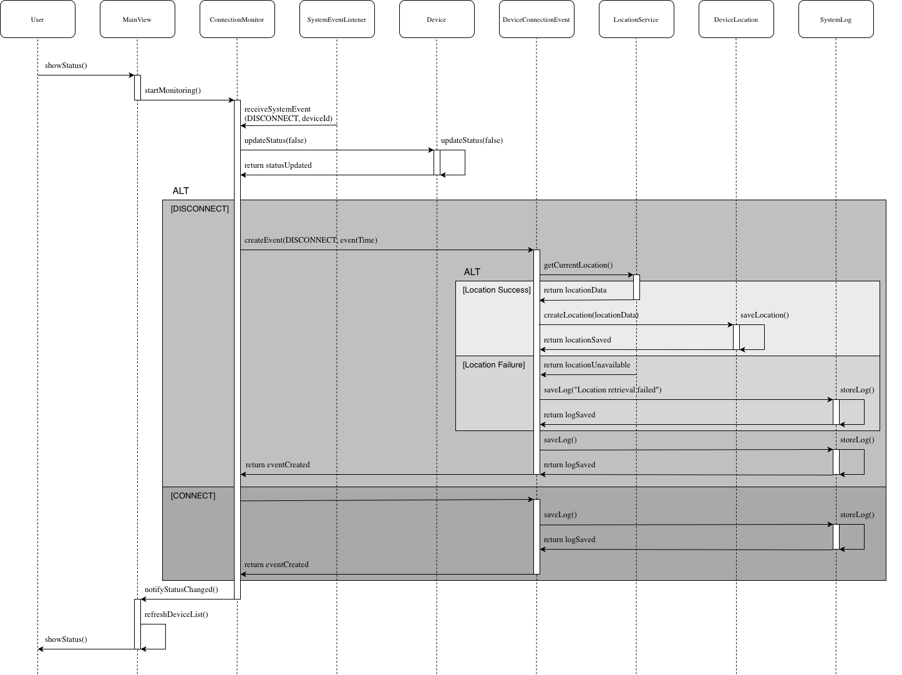
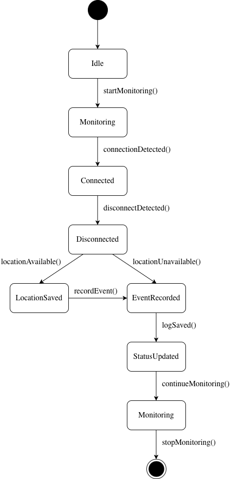

# Design

  

| No  | 22212058  |
| --- | --- |
| Name | 장민기 |
| E-mail | mingijang@yu.ac.kr |

---

# Revision history

| Revision date  | Version #  | Description  | Anthor  |
| --- | --- | --- | --- |
| 2026년 6월 10일 수요일  | v1.0 | MVVM + Flow + 트랜잭션 | 장민기 |
| 2026년 6월 10일 수요일  | v1.2 | FGS · 장치매칭 · POWER 분리 | 장민기 |
| 2026년 6월 10일 수요일  | v1.4 | 대시보드 개편 · BT 모니터링 | 장민기 |
| 2026년 6월 13일 토요일  | v2.0 | DSA 인덱스 · 패키지 구조 정리 | 장민기 |
| 2026년 6월 13일 토요일  | v2.0 | WAL · 부분 인덱스 · ANR 수정 | 장민기 |
| 2026년 6월 13일 토요일  | v2.0 | DB 캐시 테이블 · DSA/DB 최적화 | 장민기 |
| 2026년 6월 15일 월요일  | v2.0.2 | 설정·백업·구조 정리 | 장민기 |
| 2026년 6월 15일 월요일  | v2.0.3 | BT 추적 수정 · 파일명/패키지 최적화 · 데드코드 제거 | 장민기 |

---

# Contents

1. Introduction
2. Class diagram
3. Sequence diagram
4. State machine diagram
5. Implementation requirements
6. Glossary
7. References

---

# 1. Introduction

본 문서는 Android 기반 주변기기 분실 방지 앱인 Last의 소프트웨어 설계 내용을 기술하기 위한 문서이다. Last는 사용자가 자주 사용하는 Bluetooth 장치, USB 장치, 충전기 등의 주변기기를 보다 효율적으로 관리하고 분실 가능성을 줄일 수 있도록 지원하는 시스템이다.

기존의 위치 추적 서비스는 특정 제조사 또는 인증된 장치에 한정되는 경우가 많으며, 일반적인 주변기기의 마지막 사용 위치를 확인하기 어렵다는 한계가 존재한다. Last는 이러한 문제를 해결하기 위해 주변기기의 연결 상태를 지속적으로 모니터링하고, 연결 해제 이벤트가 발생하는 시점의 위치 정보와 시간 정보를 기록한다. 이를 통해 사용자는 주변기기를 마지막으로 사용한 장소를 확인할 수 있으며, 분실 상황 발생 시 보다 쉽게 위치를 추정할 수 있다.

본 앱은 Android의 Bluetooth 서비스, USB Host 이벤트 감지 기능, 위치 서비스 및 로컬 데이터 저장 기능을 활용하여 구현된다. 또한 실시간 위치 추적 방식이 아닌 마지막 연결 상태 기록 방식을 사용함으로써 시스템 자원 사용을 최소화하고 사용자 개인정보를 보호하도록 설계하였다.

본 설계 문서에서는 시스템 구현에 필요한 주요 설계 요소를 제시한다. 먼저 객체지향 구조를 기반으로 시스템을 구성하는 클래스와 클래스 간의 관계를 정의하는 Class Diagram을 작성한다. 이후 주요 기능의 동작 흐름을 설명하기 위한 Sequence Diagram과 시스템 상태 변화를 표현하는 State Machine Diagram을 설계한다. 또한 구현 환경 및 개발 요구사항을 정의하고, 시스템에서 사용되는 주요 용어와 참고 문헌을 정리한다.

Last 시스템의 주요 기능은 다음과 같다.

- 주변기기 등록
- 주변기기 연결 상태 모니터링
- 연결 해제 이벤트 감지
- 마지막 위치 정보 저장
- 연결 기록 조회
- 마지막 위치 확인
- 사용자 설정 관리

본 설계를 통해 주변기기 분실 문제를 해결하기 위한 효율적이고 실용적인 macOS 기반 시스템 구조를 제시하고자 한다.

---

# 2. Class diagram

  

---

### Table 2-1. MainView

| 항목  | 내용  |
| --- | --- |
| 클래스명 | MainView |
| 유형 | Boundary |
| 설명 | 사용자에게 등록된 장치 목록과 현재 연결 상태를 제공하는 메인 화면이다. 사용자와 시스템 간의 상호작용을 담당한다. |
| 속성 | 없음 |
| 메서드 | showDevices(), showStatus() |
| 관련 클래스 | User, Device |
| 기타 | 사용자가 시스템에 접근할 때 가장 먼저 확인하는 화면이다. |

### Table 2-2. RegisterView

| 항목  | 내용  |
| --- | --- |
| 클래스명 | RegisterView |
| 유형 | Boundary |
| 설명 | 새로운 장치를 등록하기 위한 사용자 인터페이스를 제공한다. 사용자 입력을 받아 장치 등록 기능을 수행한다. |
| 속성 | 없음 |
| 메서드 | registerDevice() |
| 관련 클래스 | Device |
| 기타 | 장치 등록 기능을 담당하는 화면이다. |

### Table 2-3. HistoryView

| 항목  | 내용  |
| --- | --- |
| 클래스명 | HistoryView |
| 유형 | Boundary |
| 설명 | 장치의 연결 및 연결 해제 이력을 사용자에게 제공하는 화면이다. |
| 속성 | 없음 |
| 메서드 | showHistory() |
| 관련 클래스 | SystemLog |
| 기타 | 과거 이벤트 기록을 조회하기 위한 인터페이스이다. |

### Table 2-4. MapView

| 항목  | 내용  |
| --- | --- |
| 클래스명 | MapView |
| 유형 | Boundary |
| 설명 | 연결이 해제된 장치의 마지막 위치를 지도 형태로 사용자에게 제공한다. |
| 속성 | 없음 |
| 메서드 | showLocation() |
| 관련 클래스 | DeviceLocation |
| 기타 | 분실 장치의 위치 확인을 지원한다. |

### Table 2-5. SettingsView

| 항목  | 내용  |
| --- | --- |
| 클래스명 | SettingsView |
| 유형 | Boundary |
| 설명 | 시스템 설정 및 사용자 환경설정을 변경하기 위한 인터페이스를 제공한다. |
| 속성 | 없음 |
| 메서드 | updateSettings() |
| 관련 클래스 | User |
| 기타 | 사용자 맞춤 설정을 관리한다. |

---

### Table 2-6. ConnectionMonitor

| 항목  | 내용  |
| --- | --- |
| 클래스명 | ConnectionMonitor |
| 유형 | Control |
| 설명 | 장치 연결 상태를 지속적으로 감시하고 상태 변화 발생 시 DeviceConnectionEvent를 생성하는 제어 객체이다. |
| 속성 | monitoring : Boolean |
| 메서드 | startMonitoring(), stopMonitoring(), detectConnectionEvent() |
| 관련 클래스 | Device, DeviceConnectionEvent |
| 기타 | 시스템의 핵심 제어 로직을 담당하며 장치 연결 상태 변화에 따라 이벤트 생성 과정을 관리한다. |

---

### Table 2-7. User

| 항목  | 내용  |
| --- | --- |
| 클래스명 | User |
| 유형 | Entity |
| 설명 | 시스템을 사용하는 사용자 정보를 저장한다. |
| 속성 | userId : String, userName : String |
| 메서드 | 없음 |
| 관련 클래스 | Device |
| 기타 | 한 명의 사용자는 여러 장치를 등록하고 관리할 수 있으므로 User와 Device는 1 관계로 모델링하였다. |

### Table 2-8. Device

| 항목  | 내용  |
| --- | --- |
| 클래스명 | Device |
| 유형 | Entity |
| 설명 | 시스템에 등록된 장치 정보를 저장하며 현재 연결 상태를 관리한다. |
| 속성 | deviceId : String, deviceName : String, deviceType : String, macAddress : String, isConnected : Boolean |
| 메서드 | connect(), disconnect(), updateStatus() |
| 관련 클래스 | User(장치 소유자), DeviceConnectionEvent(장치 상태 변화 기록) |
| 기타 | USB-C 데이터 주변기기는 UsbManager를 통해 개별 식별이 가능하나, 충전기와 같은 전원 전용 연결은 개별 장치 식별이 제한되며 전원 연결/해제 이벤트(ACTION_POWER_CONNECTED/DISCONNECTED) 수준으로 기록한다. |

### Table 2-9. DeviceConnectionEvent

| 항목  | 내용  |
| --- | --- |
| 클래스명 | DeviceConnectionEvent |
| 유형 | Entity |
| 설명 | 장치의 연결 및 연결 해제 상태 변화를 표현하는 핵심 도메인 이벤트 객체이다. |
| 속성 | eventId : String, eventType : EventType, eventTime : DateTime |
| 메서드 | createEvent(), getEventInfo() |
| 관련 클래스 | Device(이벤트 발생 대상), DeviceLocation(연결 해제 시 저장되는 위치 정보), SystemLog(이벤트 기록 저장), EventType(이벤트 유형 정의) |
| 기타 | 장치 상태 변화가 발생할 때 생성된다. DeviceLocation은 특정 이벤트에 종속적으로 생성되므로 Composition 관계를 적용하였다. |

### Table 2-10. DeviceLocation

| 항목  | 내용  |
| --- | --- |
| 클래스명 | DeviceLocation |
| 유형 | Entity |
| 설명 | 장치 연결 해제 시점의 마지막 위치 정보를 저장한다. |
| 속성 | latitude : Double, longitude : Double, address : String, timestamp : DateTime |
| 메서드 | 없음 |
| 관련 클래스 | DeviceConnectionEvent, WifiInformation |
| 기타 | 분실 장치의 위치 추적 기능에 활용된다. WifiInformation은 위치 정보를 보조하기 위한 독립적인 정보이므로 Aggregation 관계를 적용하였다. |

### Table 2-11. SystemLog

| 항목  | 내용  |
| --- | --- |
| 클래스명 | SystemLog |
| 유형 | Entity |
| 설명 | 시스템 이벤트 및 장치 연결 이력을 기록하고 관리한다. |
| 속성 | logId : String, logType : String, message : String, createdAt : DateTime |
| 메서드 | saveLog(), loadLog() |
| 관련 클래스 | DeviceConnectionEvent |
| 기타 | DeviceConnectionEvent가 실제 연결 상태 변화 이벤트를 표현한다면, SystemLog는 해당 이벤트를 기록·저장·조회하기 위한 로그 객체이다. |

### Table 2-12. WifiInformation

| 항목  | 내용  |
| --- | --- |
| 클래스명 | WifiInformation |
| 유형 | Entity |
| 설명 | 장치 주변의 Wi-Fi 정보를 저장한다. |
| 속성 | ssid : String, bssid : String, signalStrength : Integer |
| 메서드 | getWifiInfo() |
| 관련 클래스 | DeviceLocation |
| 기타 | GPS 정보를 보완하여 보다 정확한 위치 추정에 활용된다. |

---

### Table 2-13. EventType

| 항목  | 내용  |
| --- | --- |
| 클래스명 | EventType |
| 유형 | Enumeration |
| 설명 | 장치 연결 이벤트의 유형을 정의하는 열거형이다. |
| 속성 | CONNECT, DISCONNECT |
| 메서드 | 없음 |
| 관련 클래스 | DeviceConnectionEvent |
| 기타 | CONNECT는 장치 연결 상태를, DISCONNECT는 장치 연결 해제 상태를 의미하며 이벤트 유형을 명확히 구분하기 위해 사용한다. |

---

### Table 2-14. SystemEventListener

| 항목  | 내용  |
| --- | --- |
| 클래스명 | SystemEventListener |
| 유형 | External |
| 설명 | Android 운영체제로부터 BroadcastReceiver를 통해 장치 연결 상태 변경 이벤트를 수신하는 외부 인터페이스 객체이다. BroadcastReceiver를 기반으로 Bluetooth(ACTION_ACL_CONNECTED/DISCONNECTED), USB(ACTION_USB_DEVICE_ATTACHED/DETACHED), 전원(ACTION_POWER_CONNECTED/DISCONNECTED) 이벤트를 수신하여 ConnectionMonitor에 전달한다. |
| 속성 | eventListener |
| 메서드 | onReceive() |
| 관련 클래스 | ConnectionMonitor |
| 기타 | Android 운영체제와 LAST 앱 사이의 연결 역할을 수행하며 이벤트 전달을 담당한다. |

### Table 2-15. LocationService

| 항목  | 내용  |
| --- | --- |
| 클래스명 | LocationService |
| 유형 | External |
| 설명 | 위치 조회 및 위치 권한 관리를 담당하는 외부 서비스 객체이다. |
| 속성 | permissionStatus |
| 메서드 | getCurrentLocation(), requestPermission() |
| 관련 클래스 | DeviceLocation |
| 기타 | 외부 위치 서비스와 연동하여 장치 위치 정보를 제공하며 DeviceLocation 생성에 필요한 위치 데이터를 제공한다. |

---

# 3. Sequence Diagram

### Use Case : 장치 연결 해제 시 마지막 위치 저장 및 로그 기록

---

### Sequence Diagram

  

---

### Sequence Diagram Description

본 시퀀스 다이어그램은 장치 연결 해제(DISCONNECT) 이벤트 발생 시 마지막 위치 정보를 저장하고 이벤트 로그를 기록하는 과정을 표현한다.

1. User는 MainView를 통해 장치 상태를 조회한다.
2. MainView는 ConnectionMonitor에 장치 상태 모니터링을 요청한다.
3. SystemEventListener는 운영체제로부터 DISCONNECT 이벤트와 deviceId를 수신하여 ConnectionMonitor에 전달한다.
4. ConnectionMonitor는 Device의 updateStatus(false)를 호출하여 장치 연결 상태를 갱신한다.
5. Device는 내부적으로 연결 상태를 변경한 후 갱신 결과를 ConnectionMonitor에 반환한다.
6. ConnectionMonitor는 DeviceConnectionEvent 객체를 생성하여 연결 이벤트 처리를 시작한다.
7. DeviceConnectionEvent는 LocationService를 호출하여 위치 접근 권한을 요청한다.
8. LocationService는 권한 승인 결과를 DeviceConnectionEvent에 반환한다.
9. 권한이 승인된 경우 DeviceConnectionEvent는 LocationService를 호출하여 현재 위치 정보를 요청한다.
10. 위치 조회에 성공한 경우(Location Success), LocationService는 위치 정보를 DeviceConnectionEvent에 반환한다.
11. DeviceConnectionEvent는 DeviceLocation 객체를 생성하고 마지막 위치 정보(latitude, longitude, address)를 저장한다.
12. DeviceLocation은 위치 정보 저장이 완료되었음을 DeviceConnectionEvent에 반환한다.
13. 위치 조회에 실패한 경우(Location Failure), DeviceConnectionEvent는 위치 조회 실패 로그를 SystemLog에 저장한다.
14. DeviceConnectionEvent는 발생한 연결 이벤트 정보를 SystemLog에 저장한다.
15. SystemLog는 로그 저장을 수행한 후 저장 결과를 DeviceConnectionEvent에 반환한다.
16. DeviceConnectionEvent는 이벤트 생성 및 저장이 완료되었음을 ConnectionMonitor에 반환한다.
17. ConnectionMonitor는 MainView에 장치 상태 변경 사실을 전달한다.
18. MainView는 장치 목록을 갱신하여 최신 상태를 반영한다.
19. MainView는 User에게 최신 장치 상태를 표시한다.
20. 위치 정보 저장이 성공한 경우 MainView는 User에게 마지막 위치 정보를 표시한다.

※ CONNECT 이벤트가 발생한 경우에는 DeviceConnectionEvent를 생성한 후 위치 저장 과정은 수행하지 않고 이벤트 로그만 저장한다.

---

# 4. State machine diagram

  

---

본 State Machine Diagram은 사용자가 등록한 장치의 연결 상태를 모니터링하는 과정에서 발생하는 상태 변화와 이벤트 처리 과정을 표현한다. 시스템은 장치 연결 상태를 지속적으로 감시하며, 연결 해제(DISCONNECT) 이벤트가 발생하면 마지막 위치 정보를 저장하고 이벤트 로그를 기록한 후 사용자 화면을 갱신한다. 이후 다시 모니터링 상태로 복귀하여 장치 상태 감시를 계속 수행한다. 본 다이어그램은 장치 연결 상태 변화에 따른 시스템의 동작 흐름을 상태 중심으로 표현한다.

---

### 4.1 State Description

#### Idle

사용자가 시스템에 접속한 후 장치 모니터링을 시작하기 전의 대기 상태이다.

#### Monitoring

ConnectionMonitor가 등록된 장치의 연결 상태를 지속적으로 감시하는 상태이다.

#### Connected

장치가 정상적으로 연결되어 있는 상태이다. 사용자는 장치를 정상적으로 사용할 수 있으며 시스템은 연결 상태를 유지한다.

#### Disconnected

장치 연결이 해제된 상태이다. 시스템은 마지막 위치 저장 여부를 판단하고 후속 이벤트 처리 과정을 수행한다.

#### LocationSaved

장치 연결 해제 시 획득한 마지막 위치 정보를 저장한 상태이다. 저장된 위치 정보는 이후 사용자에게 마지막 위치 정보를 제공하는 데 사용된다.

#### EventRecorded

장치 연결 또는 연결 해제 이벤트가 SystemLog에 기록된 상태이다. 위치 저장 성공 여부와 관계없이 이벤트 정보는 반드시 기록된다.

#### StatusUpdated

장치 상태 및 관련 정보가 사용자 화면에 반영된 상태이다. 사용자는 갱신된 장치 상태와 마지막 위치 정보를 확인할 수 있다.

#### Final State

사용자가 모니터링을 종료하면 도달하는 종료 상태이다. 시스템의 상태 흐름은 Final State에서 종료된다.

---

### 4.2 State Transition Description

#### Initial State → Idle

시스템이 실행되면 Idle 상태로 전이된다.

#### Idle → Monitoring

사용자가 startMonitoring() 이벤트를 수행하면 Monitoring 상태로 전이된다.

#### Monitoring → Connected

connectionDetected() 이벤트가 발생하여 장치 연결이 확인되면 Connected 상태로 전이된다.

#### Connected → Disconnected

disconnectDetected() 이벤트가 발생하여 장치 연결이 해제되면 Disconnected 상태로 전이된다.

#### Disconnected → LocationSaved

locationAvailable() 이벤트가 발생하여 위치 정보 획득이 가능한 경우 마지막 위치 정보를 저장하고 LocationSaved 상태로 전이된다.

#### Disconnected → EventRecorded

locationUnavailable() 이벤트가 발생하여 위치 정보를 획득할 수 없는 경우 위치 저장 과정을 생략하고 EventRecorded 상태로 전이된다.

#### LocationSaved → EventRecorded

recordEvent() 이벤트가 발생하면 연결 해제 이벤트를 기록하기 위해 EventRecorded 상태로 전이된다.

#### EventRecorded → StatusUpdated

logSaved() 이벤트가 발생하여 이벤트 로그 저장이 완료되면 StatusUpdated 상태로 전이된다.

#### StatusUpdated → Monitoring

continueMonitoring() 이벤트가 발생하면 Monitoring 상태로 복귀하여 장치 상태 감시를 계속 수행한다.

#### Monitoring → Final State

사용자가 stopMonitoring() 이벤트를 수행하면 Final State로 전이된다.

---

### Design Considerations

1. 장치 연결 상태를 Connected와 Disconnected 상태로 명확하게 구분하여 연결 여부를 직관적으로 표현하였다.
2. 장치 연결 해제 시 마지막 위치 저장 과정을 LocationSaved 상태로 분리하여 위치 정보 관리 과정을 명확하게 표현하였다.
3. 위치 저장 성공 여부와 관계없이 이벤트 로그는 반드시 기록되도록 EventRecorded 상태를 독립적으로 구성하였다.
4. 상태 변경 후 사용자 인터페이스 갱신 과정을 StatusUpdated 상태로 분리하여 사용자가 최신 장치 상태와 마지막 위치 정보를 확인할 수 있도록 설계하였다.
5. 상태 처리 완료 후 Monitoring 상태로 복귀하도록 설계하여 지속적인 장치 상태 감시가 가능하도록 하였다.
6. 상태 간 전이는 이벤트 기반으로 표현하여 UML State Machine Diagram 표준을 준수하였다.
7. State Machine Diagram의 상태 흐름은 Sequence Diagram에서 정의한 위치 저장, 이벤트 기록 및 화면 갱신 과정을 반영하여 설계하였다.

---

# 5. Implementation requirements

본 시스템은 사용자가 등록한 장치의 연결 상태를 모니터링하고, 장치 연결 해제 시 마지막 위치 정보를 저장하며 이벤트 로그를 기록하는 기능을 제공한다. 이를 구현하기 위해 다음과 같은 하드웨어 및 소프트웨어 환경이 요구된다.

---

### 5.1 Hardware Requirements

| Item  | Specification  |
| --- | --- |
| Development Device | PC (Windows/macOS/Linux) |
| Test Device | GPS를 지원하는 Android 스마트폰 |

### Description

- 앱 개발을 위해 Android Studio 실행이 가능한 PC가 필요하다.
- 마지막 위치 정보 저장 기능 테스트를 위해 GPS를 지원하는 Android 스마트폰이 필요하다.

---

### 5.2 Software Requirements

| Item  | Specification  |
| --- | --- |
| Development Environment | Android (Android 8.0 / API 26 이상) |
| Development Language | Kotlin |
| Development Tool | Android Studio |
| Architecture | MVVM Architecture |
| Database | Room (SQLite) |
| Location Service | FusedLocationProvider (Google Play Services Location) |

### Description

- Android Studio를 이용하여 앱을 개발한다.
- Kotlin 언어를 이용하여 애플리케이션을 구현한다.
- MVVM 아키텍처를 적용하여 사용자 인터페이스와 비즈니스 로직을 분리한다.
- SQLite를 이용하여 위치 정보 및 이벤트 로그를 저장한다.
- FusedLocationProvider를 이용하여 장치의 현재 위치 및 마지막 위치 정보를 획득한다.

---

## Design Considerations

1. ConnectionMonitor를 중심으로 장치 연결 상태를 지속적으로 감시할 수 있도록 설계하였다.
2. LocationService를 이용하여 장치 연결 해제 시 마지막 위치 정보를 획득하고 저장할 수 있도록 설계하였다.
3. DeviceConnectionEvent를 통해 연결 및 연결 해제 이벤트를 관리하도록 설계하였다.
4. SystemLog를 이용하여 이벤트 이력을 저장하고 추후 조회가 가능하도록 설계하였다.
5. SQLite를 이용하여 위치 정보 및 로그 데이터를 효율적으로 관리할 수 있도록 설계하였다.
6. MVVM 아키텍처를 적용하여 사용자 인터페이스와 비즈니스 로직을 분리하고 유지보수성과 확장성을 향상시키도록 설계하였다.
7. 구현 환경은 장치 상태 모니터링, 위치 정보 저장 및 이벤트 로그 관리 기능을 안정적으로 수행할 수 있도록 구성하였다.
8. 위치 정보 수집 기능을 위해 Android 런타임 권한 모델에 따라 사용자 위치 권한(Location Permission)을 관리할 수 있도록 설계하였다.
9. 위치 정보 수집 기능은 사용자 권한 설정 및 시스템 정책을 고려하여 동작하도록 설계하였다.

---

# 6. Glossary

| Term  | Description  |
| --- | --- |
| Device | 사용자가 등록하여 연결 상태를 모니터링하는 장치 |
| Connection | 장치와 시스템 간의 연결 상태 |
| Disconnection | 장치와 시스템 간의 연결이 해제된 상태 |
| Last Location | 장치 연결 해제 시 저장되는 마지막 위치 정보 |
| System Log | 장치 연결 및 연결 해제 이벤트를 기록하는 로그 정보 |
| GPS | 위성 신호를 이용하여 위치 정보를 제공하는 시스템 (Global Positioning System) |
| Location Permission | 위치 정보 수집을 위해 사용자에게 요청되는 권한 |
| MVVM Architecture | Model, View, ViewModel 계층을 분리하여 유지보수성과 확장성을 향상시키는 소프트웨어 아키텍처 |
| Room (SQLite) | Android에서 위치 정보 및 이벤트 로그를 저장하기 위한 데이터베이스 라이브러리 |
| FusedLocationProvider | Android 환경에서 위치 정보를 획득하기 위해 사용하는 위치 서비스 API |

---

# 7. References

[1] Android Developer Documentation (Kotlin)

Kotlin 언어의 특징 및 애플리케이션 개발 방법을 참고

[2] Android Developer Documentation (Android Studio)

Android 애플리케이션 개발 환경 및 개발 도구 활용 방법을 참고

[3] Android Developer Documentation (FusedLocationProvider / Location)

위치 정보 수집 및 위치 서비스 구현 방법을 참고하기 위해 사용

[4] Android Room Persistence Library Documentation

위치 정보 및 이벤트 로그 저장을 위한 데이터 관리 방법을 참고하기 위해 사용

[5] Object Management Group (OMG) UML Specification

UML 표기법 및 다이어그램 작성 기준을 참고하기 위해 사용

[6] UML Distilled (Martin Fowler)

Class Diagram, Sequence Diagram 및 State Machine Diagram 작성 방법을 참고하기 위해 사용

[7] Android Developer Documentation (BluetoothManager / UsbManager API)

블루투스 및 USB 장치 연결 상태 감지 방법을 참고하기 위해 사용

---
